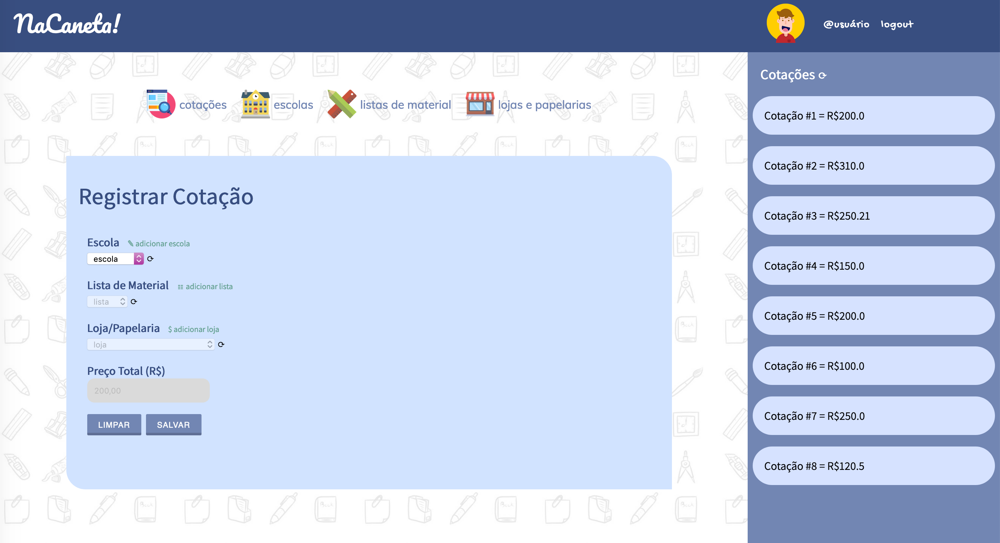

## NaCaneta! Quotation of School Supplies - Demo App

The purpose of this demo is show an example about software development following the ADIT (analyze, design, implementation and test) perspective based on object-oriented programming (OOP).

Technolgies:
- HTML, CSS, JavaScript;
- Java;
- MAVEN;
- Junit;
- Selenium;
- Spring MVC;
- MySQL;

Requirements:
- Java 8+;
...

## The Idea

## Modeling

## Testing
  
## Deploying

## Clean up

## Reference links

## License summary
This sample code is made available under the MIT-0 license. See the LICENSE file.